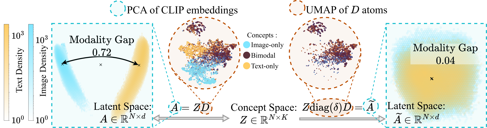
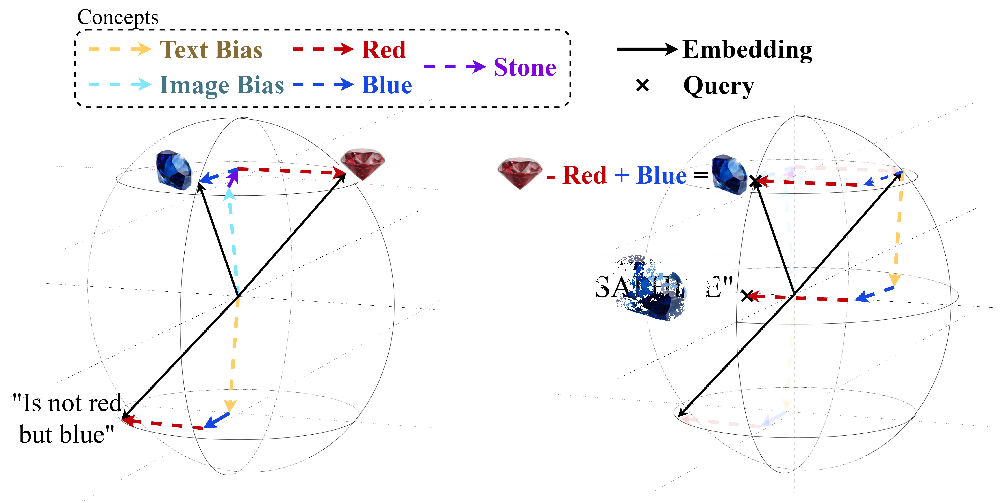

# Cross-Modal Redundancy and the Geometry of Vision–Language Embeddings

This repository contains the source code for the paper ["Cross-Modal Redundancy and the Geometry of Vision–Language Embeddings"](TODO:link_to_paper), published as a conference paper at ICLR 2026.

## Paper Overview

This work investigates the geometry of vision-language embeddings, focusing on SAE-enabled concept-based decompositions. We formalize hypotheses about the data generative process behind vision-language embeddings as emerging from a shared latent variable model, and operationalize these hypotheses through sparse autoencoders with added regularization. Through systematic interventions, we show that our dictionary atoms can be categorized into shared and modality-specific using the simple IsoEnergy condition. We further demonstrate that shared atoms are necessary and sufficient for cross-modal retrieval, while modality-specific atoms encode relevant information for unimodal tasks but act as noise for cross-modal transfer.

<div align="right">
  
</div>

**Figure 1.** On the left-hand side, this figure illustrates concept decomposition : $A = Z D$, where $A$ are latent CLIP embeddings, $Z$ are the corresponding codes, and $D$ is the dictionary. A visualisation of the latent space, as a PCA of $A$, shows the well known phenomenon of *modality gap* between image and text embeddings, colored in blue and orange respectively. The dictionary atoms $D$ are visualised through a UMAP, colored by whether they are shared or modality-specific and sized such that their area is proportional to their activation energy.

On the right-hand side, we show and example of systematic intervention : once in concept space, zero-out modality-specific atoms to obtain $\widetilde{A}$. These new embeddings are then visualised, illustrating how our method closes what is commonly referred to as the "modality gap". These new embeddings preserve cross-modal retrieval performance.

<div align="left">
  
</div>

**Figure 2.** This figure illustrates how concept-based decompositions enable semantic vector arithmetic in multi-modal settings. Latent embeddings can be decomposed into atomic concepts. This decomposition makes it clear how standard vector arithmetic manipulates modality-specific concepts in cross-modal transfer cases, producing a chimera embedding that combines both text-only and image-only concepts. By restricting the arithmetic to shared concepts only, we obtain a much more semantically meaningful result.

<div style="clear: both;"></div>

## Repository Structure

The source code found in `src/` can be used to reproduce the main experiments in the paper. They are organized as follows:
- `losses.py`: copy of the `overcomplete` library's loss file with added losses for SAE training.
- `metrics.py`: can be used to compute various standard metrics for SAE evaluation.
- `train.py`: copy of the `overcomplete` library's training script with added options for joint training of multiple SAEs under various regularization schemes.
- `utils.py`: utility functions for data loading, preprocessing, and evaluation.

A demo Jupyter notebook `demo.ipynb` is also provided to illustrate how to use the code for training and evaluating SAEs on vision-language embeddings, and replicates some of the results from the paper.

**Note :** *you might want to modify paths in `src/utils.py` to match your local setup. The notebook shows how to download the FashionIQ dataset for our purposes, but assumes other datasets to be available.*

## Requirements

You can find a list of requirements in `requirements.txt`. We recommend using a virtual environment to install the dependencies.

## Citation

If you find this work useful in your research and use concept-based decompositions for multi-modal embeddings, please consider citing our paper:

```bibtex
TODO:bibtex_entry
```
